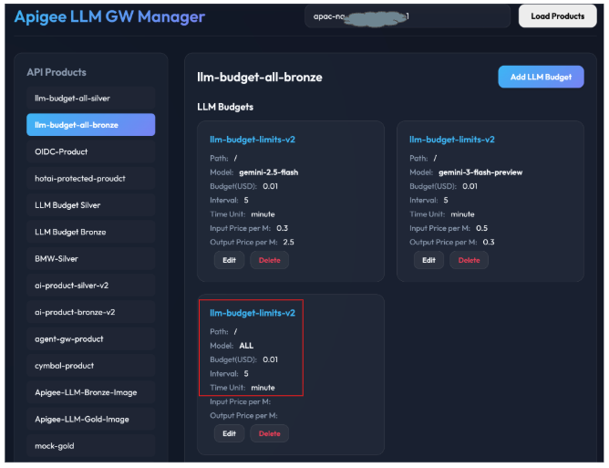
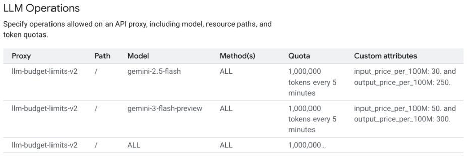
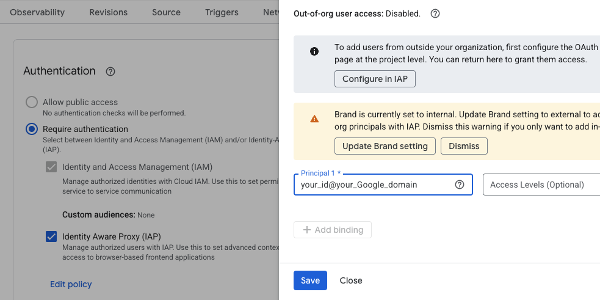
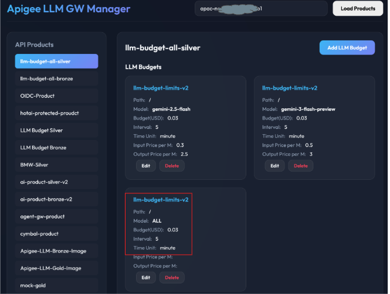
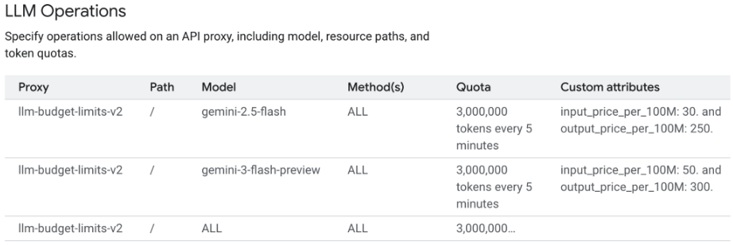

# Apigee LLM Budget & Quota Management

This project provides an advanced solution for managing budgets and quotas for LLM (Large Language Model) API calls using Apigee X.

It is an improvement upon [llm-budget-limits-v1](https://github.com/cbhong-ops/llm-budget-limits-v1.git). The key enhancement is the ability to calculate and aggregate costs across multiple different models, comparing the total cost against a user's or client's overall budget, and blocking access until the next interval if the quota is reached.

## Key Features

1.  **Multi-Model Cost Aggregation**: Calculates and aggregates the actual costs incurred from calling various LLM models based on their specific input and output token unit prices.
2.  **Global Budget Enforcement**: Compares the total accumulated cost against a configured overall budget (quota) for a user or client. If the limit is reached, access is blocked until the next time interval.
3.  **Dynamic Pricing and Budget Configuration**: You can input and manage budget and token unit prices for each LLM Operation in the API Product via a Web UI.
4.  **Apigee Proxy Integration**: When an API is called, it extracts the LLM Operation information registered in the API Product, calculates the actual cost in real-time by combining it with the token usage from the LLM response, and deducts it from the quota.

---

## Project Structure

-   `apiproxy/`: Apigee API Proxy bundle
    -   Enforces quota based on cost using `LLMTokenQuota` policies (`LTQ-TokenEnforce` and `LTQ-TokenCount`).
    -   `retrievePricingInfo.js`: Reads pricing information from the API Product and calculates the total cost by multiplying it with the response token count.
-   `budget-ui/`: Web UI for managing LLM Operations and budgets (Python Flask)
    -   Calls Apigee APIs to manage `llmOperationGroup` in API Products.
-   `notebook/`: Jupyter notebook for testing
    -   `llm_budget_limits_v1.ipynb`: Test notebook designed to be run in Colab Enterprise.

---

## Architecture and Workflow

### 1. Configuration via UI (`llm-budget-ui`)
-   Users select an API Product in the UI and configure the budget and pricing in two steps:
    1.  **Global Budget Setup**: To manage the overall budget across all models, create a configuration with the **Model** name set to `ALL`. Specify the **Budget** (in USD), **Interval**, and **Time Unit**, without entering any unit prices.
    2.  **Model-Specific Pricing Setup**: For each individual model (e.g., `gemini-2.5-flash`), enter the specific token unit prices:
        -   **Input Price per M**: Input price per 1 Million tokens (in USD)
        -   **Output Price per M**: Output price per 1 Million tokens (in USD)
-   This information is stored in `operationConfigs` within `llmOperationGroup` of the API Product.
    -   The budget is stored as an integer multiplied by `100,000,000` in `llmTokenQuota.limit`. (i.e., $1 = 100,000,000 units)
    -   Unit prices are stored in `attributes` as `input_price_per_100M` and `output_price_per_100M`, multiplied by `100`. (e.g., entering $1.5 stores 150)

-   The following screen shows budget settings by model in API Product.


-   And these budgets and unit prices are displayed in llmOperations as follows.



### 2. API Proxy Behavior (`llm-budget-limits-v2`)
-   **On Request**:
    -   `VA-VerifyAPIKey` verifies the client's API Key and retrieves the `llmOperationGroup` JSON data set in the API Product.
    -   `LTQ-TokenEnforce` policy checks if the current accumulated cost exceeds the budget.
-   **On Response**:
    -   `AM-ExtractTokenCount`: Reads `promptTokenCount`, `candidatesTokenCount`, and `thoughtsTokenCount` from the Gemini response's `usageMetadata`.
    -   In `retrievePricingInfo.js`:
        1.  Finds the `operationConfig` matching the called model and extracts the unit prices.
        2.  Calculates total cost: `(promptTokens * inputPrice) + ((candidatesTokens + thoughtsTokens) * outputPrice)`.
        3.  The calculated cost is saved in the `token_price_per_100M` variable.
    -   `LTQ-TokenCount` policy updates the quota counter using the value of `token_price_per_100M`.


---

## Installation and Deployment

### 1. Clone the Repository

1.  Open **Cloud Shell** in the Google Cloud Console.
2.  Clone this repository and navigate to the project directory:
    ```bash
    git clone https://github.com/cbhong-ops/llm-budget-limits-v2.git
    cd llm-budget-limits-v2
    ```
### 2. Environment Setup

1.  Set up Application Default Credentials (ADC) in Cloud Shell. This is required because the deployment scripts use `apigeecli` with the `--default-token` flag:
    ```bash
    gcloud auth application-default login
    ```
2.  Configure the `env.sh` file in the project root directory with your specific values:

    -   `PROJECT_ID`: Your Google Cloud Project ID
    -   `APIGEE_ENV`: Apigee environment name

3.  After configuring the variables, run the following command to apply them to your current shell session:
    ```bash
    source ./env.sh
    ```


### 3. API Proxy, API Product, Developer and Client App Setup
1.  Ensure `env.sh` is configured correctly.
2.  Run the deployment script from the root directory: `./deploy-llm-budget-limits-v2.sh`
    *   It bundles and deploys the API Proxy (`llm-budget-limits-v2`).
    *   It creates API Products (`llm-budget-all-bronze`, `llm-budget-all-silver`), a Developer (`budget-all-dev@example.com`), and a Client App (`llm-budget-all-app`) subscribed to these products.
    *   It outputs the API keys for the products. **Important**: Please check the terminal output carefully and save these API keys, as you will need them for testing (e.g., in the Colab notebook).

### 4. UI Deployment and Configuration (Cloud Run)
1.  Ensure `env.sh` is configured correctly.
2.  Run the deployment script from the root directory: `./deploy-ui.sh`
    *   This script creates a service account `llm-budget-limits-v2-svc-acct` with required roles if it doesn't exist.
    *   It deploys the `llm-budget-ui-v2` service to Cloud Run using this service account.
    *   It applies `--ingress all`.
    *   **Note**: If prompted `Allow unauthenticated invocations to [llm-budget-ui-v2] (y/N)?`, answer `N` (unauthenticated access is not recommended for this management UI).

3.  After successful deployment, the Cloud Run Service URL will be displayed in the terminal output.
4.  In the Google Cloud Console, go to the **Cloud Run Services** menu, select the `llm-budget-ui-v2` service, navigate to the **Security** tab, enable **Identity-Aware Proxy (IAP)**, and add authorized users to the policy.
    *   **Note**: It may take a few minutes for the IAP configuration to take effect after enabling it. Please wait a moment before accessing the UI.

5.  Access the UI by opening the provided Cloud Run Service URL in your browser.

6.  On the UI screen:
    *   Enter your **Apigee Org** name (Same as your Google Cloud Project ID).
    *   Select the **API Product** you want to configure (e.g., `llm-budget-all-bronze` or `llm-budget-all-silver`).
    *   **Crucial Step (Global Budget)**: First, add a configuration for the model named `ALL`. Enter the overall global **Budget**, **Interval**, and **Time Unit** to cap total usage, leaving the unit costs empty.
    *   **Model-Specific Pricing**: Next, set the specific **Unit Costs** (Input/Output prices) for each required individual Model (e.g., `gemini-2.5-flash`).
    *   **Note**: You can refer to the [Gemini Models Pricing Page](https://cloud.google.com/gemini-enterprise-agent-platform/generative-ai/pricing) for the unit costs of Gemini models.


### Configuration Examples

#### Example 1: llm-budget-bronze
When you select `llm-budget-bronze` and set the values in the UI:


These settings are reflected in the `llmOperations` of the **llm-budget-bronze** API Product:


#### Example 2: llm-budget-silver
Similarly, for `llm-budget-silver`, you can configure it in the UI:


And it will be reflected in the **llm-budget-silver** API Product:



---

## Testing with Colab Enterprise

You can use the provided Jupyter notebook to test the Apigee LLM Budget & Quota Management system. The notebook is located at `notebook/llm_budget_limits_v2.ipynb`.

### Prerequisites
- A Google Cloud Project with the following APIs enabled:
    - **Vertex AI API** (`aiplatform.googleapis.com`)
    - **Dataform API** (`dataform.googleapis.com`)
    - **Compute Engine API** (`compute.googleapis.com`)
- Billing enabled for your Google Cloud project.
- Necessary IAM roles for users (e.g., `roles/aiplatform.colabEnterpriseUser` to create and run notebooks).
- An Apigee API Proxy deployed and an API Key generated for a product that includes the proxy.

### Steps to run in Colab Enterprise

1.  **Access Colab Enterprise**:
    - Go to the Google Cloud Console.
    - Search for "Vertex AI" and navigate to the Vertex AI dashboard.
    - In the left navigation menu, click on **Colab Enterprise**.

2.  **Import the Notebook**:
    - Download the file `notebook/llm_budget_limits_v2.ipynb` from Cloud Shell to your local machine.
    - In the Colab Enterprise UI, click on the **Import notebooks** icon in the **Quick Actions** section.
    - Select the notebook file you just downloaded to import it.
    - **Connect to a Runtime**: Click the **Connect** button at the top right of the notebook to connect to a runtime.
    - Run the first cell to install the `google-genai` SDK. (If an error occurs, you can ignore it and proceed.)


3.  **Configure Variables**:
    - In the second code cell, update the following variables with your specific values:
        - `PROJECT_ID`: Your Google Cloud Project ID.
        - `API_ENDPOINT`: The URL of your Apigee API Proxy (e.g., `https://your-apigee-hostname/v2/samples/llm-budget-limits`).
            - **Note**: You can find your Apigee hostname (`your-apigee-hostname`) in the **Management > Environments > Environment Groups** section of the Apigee Console.

        - `API_KEY`: The API Key associated with the product that grants access to the proxy.
        - `MODEL`: The model you want to test with (defaults to `gemini-2.5-flash`).
            - **Note**: You must use the model that you have configured in the Web UI. In the sample setup, `gemini-2.5-flash` and `gemini-3-flash-preview` were used.


4.  **Run the Notebook**:
    - Run the initialization cell with your updated variables.
    - Run the subsequent cells to execute the test scenarios. The notebook will send requests to the Apigee proxy, which will enforce the cost-based quota.

---

## Testing with Colab (Standard)

If you prefer to use standard Google Colab instead of Colab Enterprise:

### Steps to run in standard Colab

1.  **Access Colab**:
    - Go to [https://colab.research.google.com](https://colab.research.google.com).
2.  **Upload the Notebook**:
    - Download the file `notebook/llm_budget_limits_v2.ipynb` from Cloud Shell to your local machine.
    - In Colab, select **File > Upload notebook** and choose the file you downloaded.
3.  **Install Dependencies**:
    - Run the first cell to install the `google-genai` SDK.
    - **Note**: If an error occurs (e.g., dependency conflicts), you can ignore it and proceed.
4.  **Execute Authentication Cell**:
    - Since you are not in a Google Cloud environment, you must authenticate to access Google Cloud APIs.
    - Make sure to run the cell that contains `from google.colab import auth` and `auth.authenticate_user()` to authenticate your Google account.
5.  **Configure Variables and Run**:
    - Follow the same steps as in Colab Enterprise to configure variables (`PROJECT_ID`, `API_ENDPOINT`, `API_KEY`, `MODEL`) and run the notebook.

---

## Clean Up

To delete all resources created by this sample and avoid incurring charges:

1.  Ensure `env.sh` is configured correctly.
2.  Run the undeployment script from the root directory: `./undeploy-llm-budget-limits-v2.sh`
    *   This script deletes the Developer App, Developer, API Products (`llm-budget-all-bronze`, `llm-budget-all-silver`), and undeploys and deletes the API Proxy.
    *   It also deletes the Cloud Run service `llm-budget-ui-v2` and the associated service account `llm-budget-limits-v2-svc-acct`.
